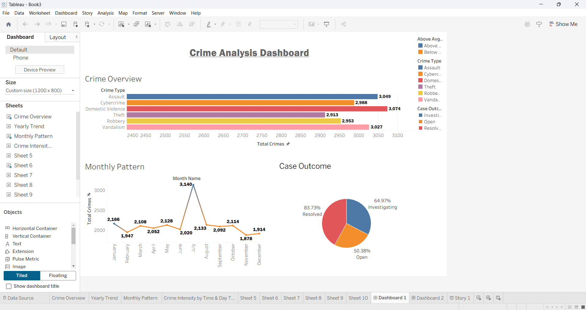

#CRIME ANALYSIS DASHBOARD

An interactive Tableau dashboard that analyzes crime trends, crime categories, case outcomes, and temporal crime patterns. The dashboard enables users to identify high-crime categories, observe monthly trends, evaluate investigation outcomes, and explore crime intensity across different time periods.

---

## Dashboard Preview

### Dashboard 1 – Crime Overview



### Dashboard 2 – Crime Insights

![Dashboard 2](

---

## Project Overview

This project provides a comprehensive visualization of crime-related data using Tableau. It transforms raw crime records into interactive dashboards that help users identify trends, compare crime categories, and analyze crime patterns over time.

The dashboards are intended for educational purposes and demonstrate data visualization techniques using Tableau.

---

## Objectives

- Analyze crime distribution across different crime types.
- Identify monthly and yearly crime trends.
- Study crime intensity based on weekdays and weekends.
- Compare crimes involving different weapon types.
- Visualize investigation and case resolution status.

---

## Dashboard Features

### Dashboard 1 – Crime Overview

- Crime Type Analysis
- Monthly Crime Pattern
- Case Outcome Distribution
- Interactive filtering and highlighting

### Dashboard 2 – Crime Insights

- Crime Intensity by Time Bucket
- Weekday vs Weekend Comparison
- Yearly Crime Trend
- Crime Type vs Weapon Used

---

## Key Insights

### Crime Overview

- Domestic Violence recorded the highest number of reported crimes.
- Theft recorded comparatively fewer cases.
- Crime occurrences fluctuate across different months.
- Case outcomes are categorized into:
  - Investigating
  - Open
  - Resolved

### Crime Insights

- Evening hours recorded the highest crime intensity.
- Weekdays consistently experienced more crimes than weekends.
- Overall crime rate shows an increasing trend over recent years.
- Different crime categories exhibit distinct weapon usage patterns.

---

## Technologies Used

- Tableau Desktop
- Microsoft Excel / CSV Dataset
- Data Visualization
- Dashboard Design

---

## Files

```
Crime-Analysis-Dashboard/
│
├── dashboard/
│   └── Crime Analysis Dashboard.twbx
│
├── data/
│   └── crime_dataset.csv
│
├── images/
│   ├── dashboard1.png
│   └── dashboard2.png
│
├── README.md
└── LICENSE
```

---

## Dataset

The dataset contains crime records with attributes such as:

- Crime Type
- Date
- Month
- Year
- Time Bucket
- Day Type (Weekday / Weekend)
- Weapon Used
- Case Outcome

---

## Visualizations Used

- Horizontal Bar Chart
- Line Chart
- Pie Chart
- Heatmap
- Stacked Bar Chart

---

## Skills Demonstrated

- Data Cleaning
- Data Transformation
- Tableau Dashboard Design
- Interactive Filters
- Calculated Fields
- Trend Analysis
- Data Storytelling
- Business Intelligence

---

## How to Open

1. Clone the repository

```bash
git clone https://github.com/yourusername/Crime-Analysis-Dashboard.git
```

2. Open the `.twbx` file using Tableau Desktop or Tableau Public.

---

## Future Enhancements

- Geographic crime map
- Predictive crime trend forecasting
- District-wise analysis
- Dynamic dashboard filters
- KPI cards
- Police station-wise crime analysis
- Drill-down dashboards

---

## Author

**Parmeet Kaur**

B.Tech Computer Science Engineering

MIT World Peace University (MIT-WPU)

---

## License

This project is licensed under the MIT License.
